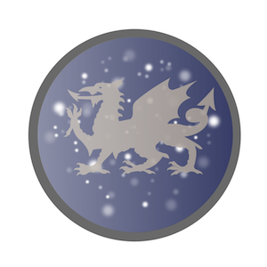

# DragonDrone: iOS
The iOS version of the Microsoft Cognitive Services computer vision demo built for a DJI Mavic Pro Drone

## Demo

---
## Requirements

### Phase 0
- [x] P1: Facial verification
- [x] P1: Manual trigger for verify (button on controller, or in app)
- [x] P1: FPV view of done
- [x] P1: Showing successful detection
- [x] P2: Local Face detection
- [x] P2: Draw boxes around identified faces
- [x] P3: Draw boxes around all detected faces
- [x] P1: Show success the app
- [x] P2: Turn lights on/off when white walker found
- [x] P1: Test AirServer with different networks
- [x] P1: Demoable -> AirServer
- [x] P1: Take off and land manually - using controller
- [x] P2: Scan animation
- [x] P1: Show identified person name

### Phase 1
- [ ] P1: take off/land in app
- [ ] P1: scan side to side to find walker
- [ ] P2: Real-time identify using [queue](https://docs.microsoft.com/en-us/azure/cognitive-services/Computer-vision/vision-api-how-to-topics/howtoanalyzevideo_vision)
- [ ] P2: emotion of found person (e.g. Kalhisi is mad!)

### Phase 2
- [ ] Record a crazy demo video of drone doing cool stuff in the wild
---

## Requirements

 - iOS 9.0+
 - Xcode 8.0+
 - DJI iOS SDK 4.0.1
 - [DJI Mavic Pro or similar drone](https://dji.com/)
 - [DJI Developer Account](https://developer.dji.com/)
 - [Microsoft Cognitive Services Account](https://azure.microsoft.com/en-us/services/cognitive-services/)

## SDK Installation with CocoaPods

Since this project has been integrated with [DJI iOS SDK CocoaPods](https://cocoapods.org/pods/DJI-SDK-iOS) now, please check the following steps to install **DJISDK.framework** using CocoaPods after you downloading this project:

**1.** Install CocoaPods

Open Terminal and change to the iOS project directory, enter the following command to install it:

~~~
sudo gem install cocoapods
~~~

The process may take a long time, please wait. For further installation instructions, please check [this guide](https://guides.cocoapods.org/using/getting-started.html#getting-started).

**2.** Install SDK with CocoaPods in the Project

Run the following command in the project path:

~~~
pod install
~~~

If you install it successfully, you should get the messages similar to the following:

~~~
Analyzing dependencies
Downloading dependencies
Installing DJI-SDK-iOS (4.0.1)
Generating Pods project
Integrating client project

Pod installation complete! There is 1 dependency from the Podfile and 1 total pod
installed.
~~~

Close any current Xcode sessions and use `DragonDrone.xcworkspace` for this project from now on.

> **Note**: If you saw "Unable to satisfy the following requirements" issue during pod install, please run the following commands to update your pod repo and install the pod again:
> 
> ~~~
> pod repo update
> pod install
> ~~~

## API Keys
This project requires you to have API keys for the DJI drone and the Microsoft Cognitive Services APIs that it uses. Set them in Info.plist
* DJISDKAppKey - [DJI SDK API Key](https://developer.dji.com/)
* Microsoft Cognitive Services - [Microsoft Cognitive Services API Keys](https://azure.microsoft.com/en-us/services/cognitive-services/)
    - FaceKey

## License

DragonDrone is available under the MIT license. Please see the LICENSE file for more info.

